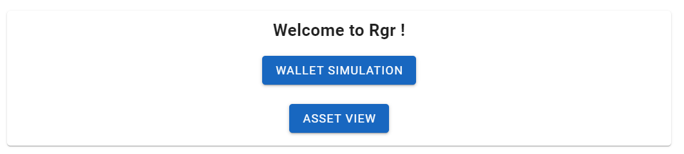
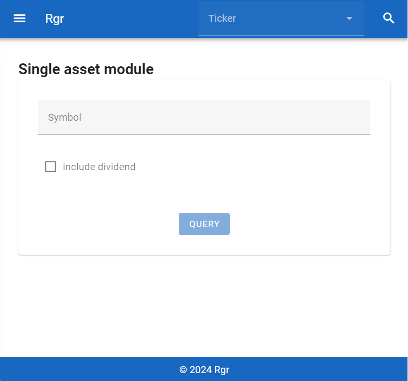
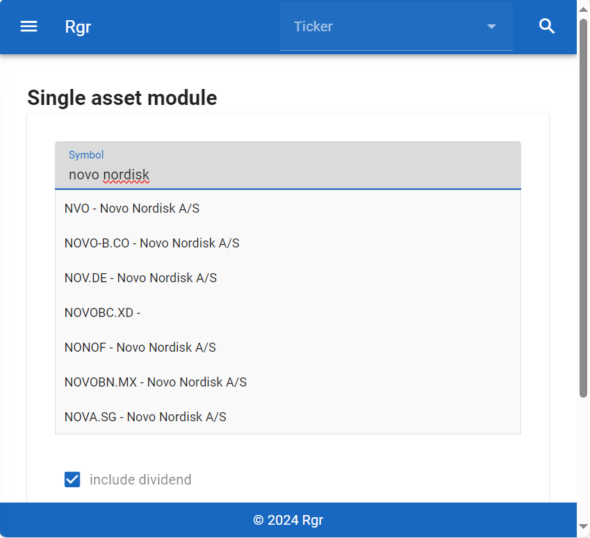
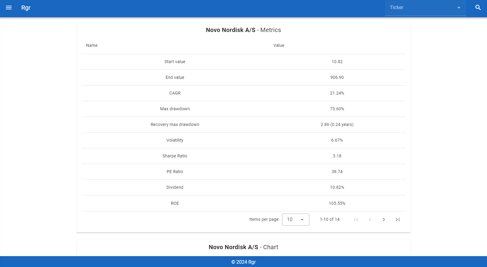
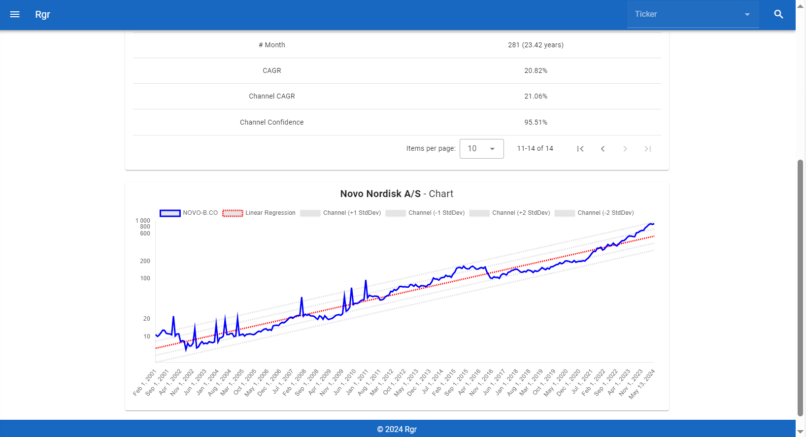
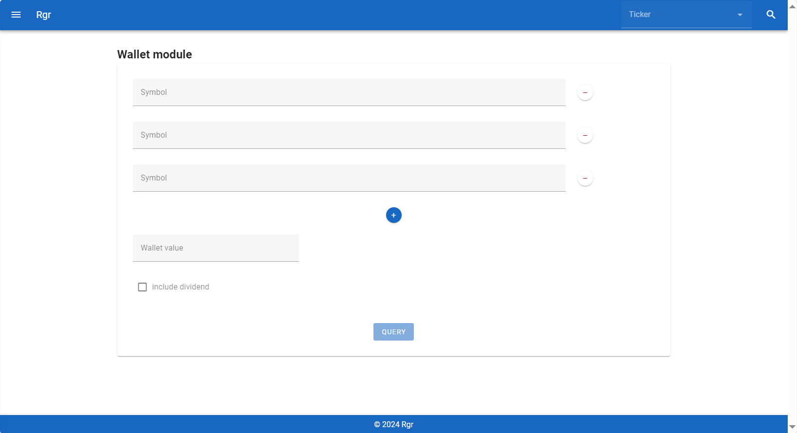
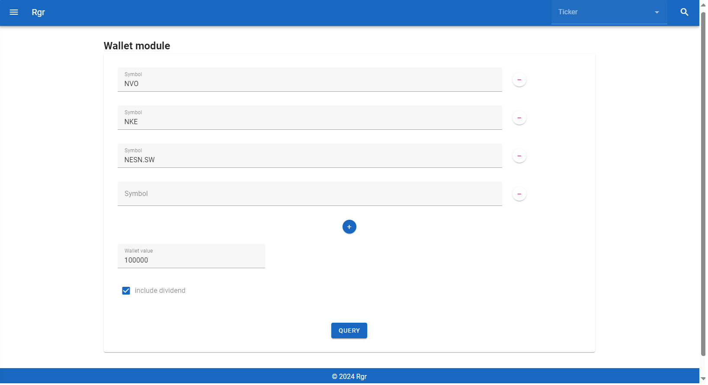
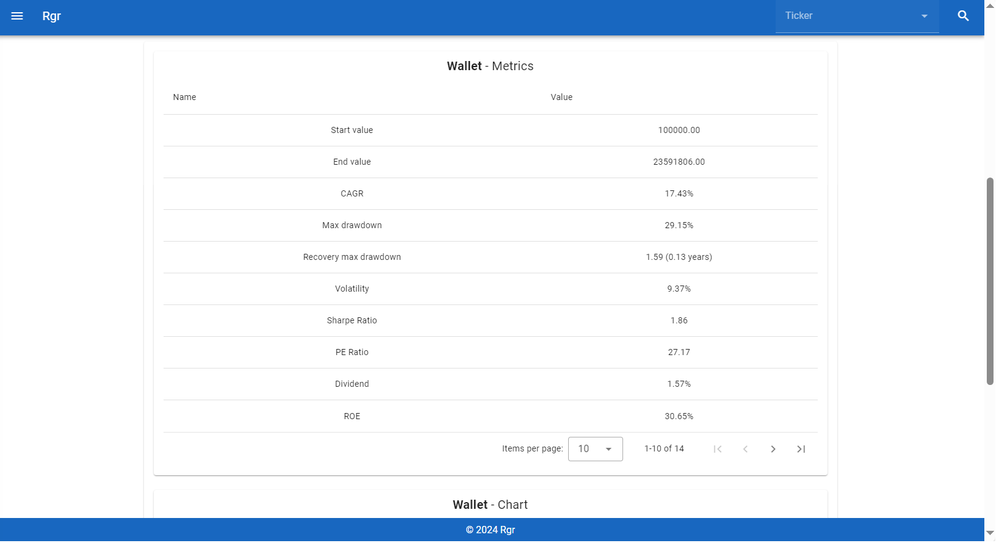
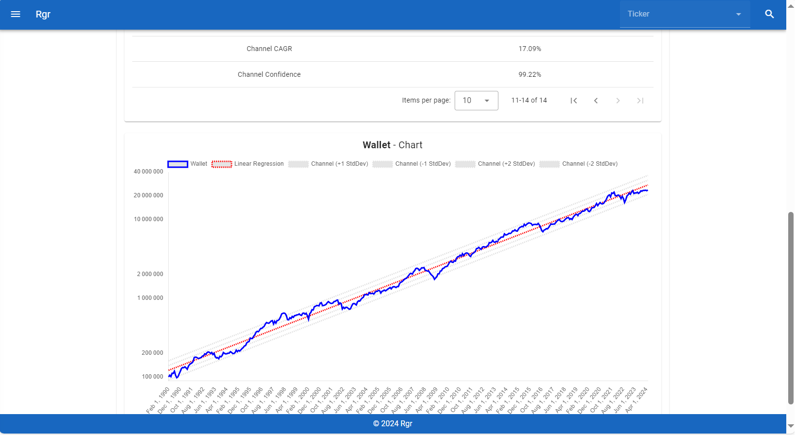

# Rgr

This responsive application is made to simulate an asset or a wallet composition.

The goal of this little app is to provide a simulation over the time of asset, as portfolio visualizer do.

You can compare asset on multiple domain (stock, commodity, bond, fund, etf etc ..).

The asset will always be display with his own currency. In wallet mode, i do not include the currency change.

## Welcome

In the welcome page you can select if you want to run a simulation on a single asset or on the wallet mode :



## Asset

The Asset page is presented as below :



On this page you can make a search to find the desired asset. To find the desired asset, type in the field "Symbol" :



I provided an auto completion that work on name or symbol, it will help you to find the good marketplace for the asset or the exact ticker.

After selected one asset you can decide to include dividend in your simulation (accumulating mode) or to exclude them (distributing mode), you need to check or unckeck the box "include dividend".

After that you can click on the button "Query".



The first table is a table with some metadata calculated on your asset.



The second table will represent your asset performance on a chart display in logarithmic scale. Also i computed a regression channel to simply define if the asset is overprice or oversold. I calculate the regression chart in another scale than asset to make it appear as linear.

## Wallet

The Wallet page is presented as below :



As on the Asset page, you can add an asset and mannipulate it :

- The button "-" : will delete the line.
- The button "+" : will add three new lines.
- The field "Wallet value" : represent the value invested at the start.
- The checkbox "include dividend" : represent if the wallet is in distributing mode or accumulating mode.

To simulate the wallet, i do a rebalancing monthly and make start the simulation on the date of the most recent asset.

If a symbol line is not not fill, it will be ignore. If you miss data the query will told you which data is required.



After all that data you can click on the button "Query".

As on the Asset page, you will get the table of metric for your wallet, it provide some interesting aggregated data as PE ratio or ROE ratio etc..



As on the Asset page, you will get the chart of metric for your wallet with the channel regression.



# Run

## Local

You can run it locally by using the docker compose :

```
docker-compose up
```

Or you can run it without docker :

```
cd front/
npm run serve
```

```
cd back/
./mvnw compile quarkus:dev
```
